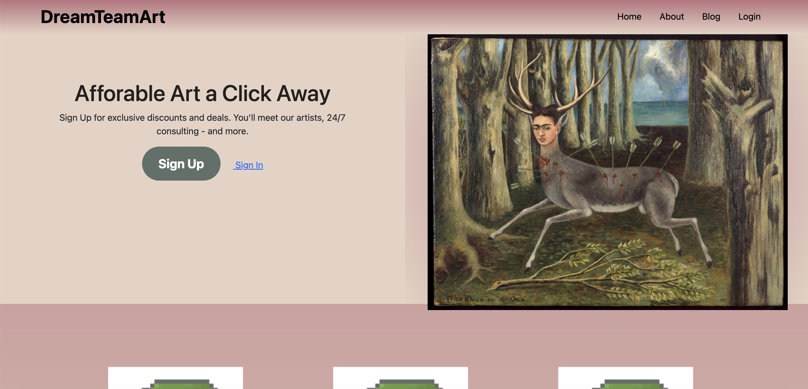

# Art Blog 🎨 🏆

# About
Our application was mainly developed using REACT and made use of NPM and Apollo. Ant design was used as our visual template to facilitate the generation of our application in the frontend. Our application also made use of MongoDb for the purpose of creating our database. This app features signups.

# Deployment 🚀
Our app was deployed through Heroku.

Check us out yourself!| 

# Preview 📷

# Resources and Credits 📣
Frontend |https://ant.design/ | https://www.w3schools.com/
Backend | Documentation 

# Contributors 🤝
Leandro Machado <a href= "https://github.com/lamachad">@lamachad</a> 

Justin Ellis <a href= "https://github.com/jdellis490">@jdellis490</a> 

Mike Walker <a href= "https://github.com/Skyw41k3r">@Skyw41k3r</a> 

Scott Pinkerton <a href= "https://github.com/Protomancer">@Protomancer</a>

Cole Hubert <a href= https://github.com/Colehubert>@Colehubert</a>